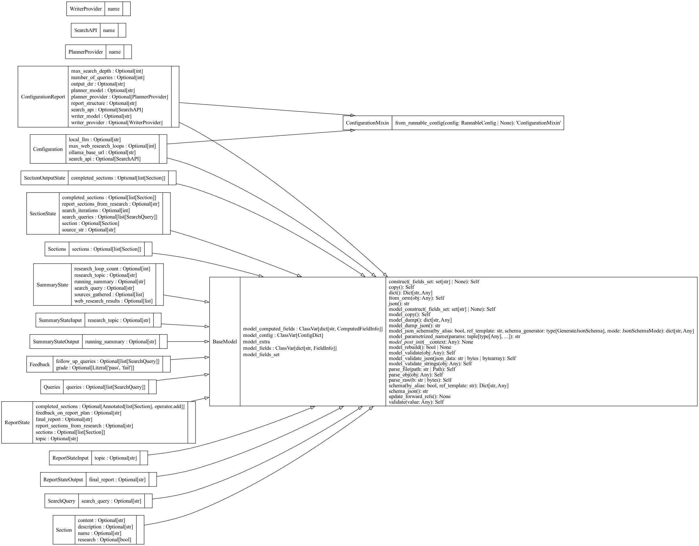

# deep researcher

Fully local web research and report writing assistant

## Getting started
1. Install dependencies
    ```bash
    uv sync
    ```
2. Create `.env` file and fill in the placeholders
    ```bash
    cp .env.example .env
    ```
3. Start up the LangGraph server
    ```bash
    uv run startserver
    ```
4. Open LangGraph Studio in Chrome browser
    ```bash
    open -a "Google Chrome" 'https://smith.langchain.com/studio/?baseUrl=http://127.0.0.1:2024'
    ```

## UML diagrams

When trying to understand the codebase, start with the `graph` object in `src/deepresearcher/graph.py`.


<br>*Deep Researcher class structure*

<br>


<br>*Deep Researcher package structure*
